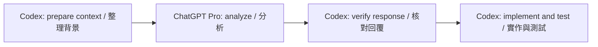

> **v0.3.1 source preview / 原始碼預覽**: global project routing and receiver source are included. Portable installer integration is being completed by Pro; this branch is not yet the final installation release. / 已含全域專案分流及接收器，Pro 正在整合可攜安裝器，本分支尚非最終安裝版。

# Codex ChatGPT Pro Handoff Skill｜Codex 專用中英協作工具

**Local pilot: 0.1.2-local.2.** This checkout adds evidence bundles, task checkpoints and optional post-implementation review. The public release link below still downloads v0.1.1. See [the bilingual workflow](skill/cj-chatgpt-handoff/references/evidence-workflow.md).

**本地試行：0.1.2-local.2。** 此版本新增證據包、任務續接與選用的實作後複審；下方公開 Release 連結仍下載 v0.1.1。操作見[中英流程](skill/cj-chatgpt-handoff/references/evidence-workflow.md)。

**ChatGPT Pro for analysis. OpenAI Codex for implementation.**<br>
**ChatGPT Pro 負責分析，OpenAI Codex 負責實作。**

[](https://github.com/ertwer2001/codex-chatgpt-pro-handoff/releases/latest)
[](#requirements)
[](#install)
[](LICENSE)

An open-source **Codex Skill for ChatGPT Pro integration and context handoff**. Send relevant project context from the Codex app to a dedicated ChatGPT GPT-6 Pro chat for **code review, debugging, software architecture, and implementation planning**. Codex retrieves the response, checks it, and performs authorized local work.

開源的 **Codex 專用 ChatGPT Pro 串接與專案背景交接 Skill**。透過 Codex app 原生對話工具，將必要背景送到專用 GPT-6 Pro 對話，協助**程式碼審查、除錯、軟體架構與實作規劃**；再由 Codex 核對建議，依授權完成本地修改與驗證。

**Community project; not an official OpenAI product. Requires native Codex app conversation tools.**<br>
**社群專案，非 OpenAI 官方產品；需要 Codex app 原生對話工具。**

[Download / 下載](#download) · [Features / 功能](#features) · [Requirements / 條件](#requirements) · [Install / 安裝](#install) · [Usage / 用法](#usage) · [FAQ / 常見問題](#faq)

<a id="download"></a>
## Download｜下載

- **[Download bilingual v0.1.1 ZIP｜下載中英對照 v0.1.1 ZIP](https://github.com/ertwer2001/codex-chatgpt-pro-handoff/releases/download/v0.1.1/codex-chatgpt-pro-handoff-v0.1.1.zip)**
- [Latest release and ZIP checksum｜最新版與 ZIP 校驗檔](https://github.com/ertwer2001/codex-chatgpt-pro-handoff/releases/latest)
- [Skill entry point｜Skill 入口](skill/cj-chatgpt-handoff/SKILL.md)

The ZIP includes source code, bilingual setup guides, a reversible installer, tests, and SHA256 manifests.<br>
ZIP 包含原始碼、中英安裝說明、可還原安裝器、測試與 SHA256 清單。

<a id="features"></a>
## Features｜功能

| Feature | English | 繁體中文 |
| --- | --- | --- |
| Pro consultation | Ask Pro to review code, compare architectures, or analyze difficult bugs; Codex implements and tests. | 請 Pro 審查程式、比較架構或分析疑難錯誤，由 Codex 實作與測試。 |
| Native handoff | Use native Codex app chat tools; keep the current Codex model and `config.toml`. | 使用 Codex app 原生對話工具，保留既有模型與 `config.toml`。 |
| Project separation | Bind a dedicated Chat per project; reject reuse across projects in the same local ledger. | 每個專案綁定專用 Chat，阻止同一本機紀錄庫內跨專案共用。 |
| Traceable responses | Track a unique Request-ID, exact prompt, new completed turn, and SHA256 receipt. | 追蹤唯一 Request-ID、完整請求、新 completed 回合與 SHA256 收據。 |
| Retry protection | Inspect uncertain sends instead of blindly sending again; no remote exactly-once guarantee. | 傳送結果不明時先查核，避免盲目重送；不保證遠端 exactly-once。 |
| Portable installation | Preview changes, preserve existing rules, verify backups, and restore without overwriting later edits. | 預覽修改、保留原有規則、核對備份；還原時不覆寫後續改動。 |



<a id="requirements"></a>
## Requirements and scope｜使用條件與範圍

| Requirement / 條件 | English | 繁體中文 |
| --- | --- | --- |
| Codex client | A Codex app session exposing the three native tools listed below. CLI/IDE availability is not guaranteed. | Codex app 工作階段須提供下列三個原生工具；不保證 CLI／IDE 皆可用。 |
| ChatGPT account | Access to GPT-6 / 6 Pro in the target Chat; confirm the selection before every send. | 帳號可在目標 Chat 選擇 GPT-6／6 Pro，且每次傳送前重新確認。 |
| Python | Python 3.10+; installer and state script use only the standard library. | Python 3.10+；安裝器與狀態腳本只用標準函式庫。 |
| New computers | Install once per computer and bind a separate Chat for each computer/project. | 每台電腦安裝一次，每台電腦／每個專案綁定獨立 Chat。 |

Required native tools / 必要原生工具：

```text
mcp__codex_app__list_threads
mcp__codex_app__read_thread
mcp__codex_app__send_message_to_thread
```

The Skill guides Codex; its Python script only records and validates local state. Installing it does not add native tools, grant file access, or add Pro to the Codex model selector. It is not a standalone MCP server or model provider. Sending `model` / `thinking` cannot switch a ChatGPT conversation to Pro.

Skill 引導 Codex 執行流程；Python 腳本只記錄及核對本機狀態。安裝不會新增原生工具、授予檔案存取權或把 Pro 加到 Codex 模型選單。它不是獨立 MCP server 或 model provider；`model`／`thinking` 參數無法替 ChatGPT 對話切換 Pro。

<a id="install"></a>
## Installation｜安裝

Download and extract the ZIP. From the directory containing `install.py`, run the commands below. Use `python3` or `py -3` if appropriate for your system.<br>
下載並解壓 ZIP，在含 `install.py` 的目錄執行以下命令；依環境改用 `python3` 或 `py -3`。

```text
python -X utf8 verify_package.py
python -X utf8 install.py
python -X utf8 install.py --apply
```

1. Verify the package hashes. / 核對套件雜湊。
2. Preview the installation without writing files. / 只預覽安裝計畫，不寫入檔案。
3. Install after reviewing the plan. / 檢視計畫後執行安裝。

The target is `CODEX_HOME`, or `~/.codex` when unset. This pilot installs six Skill files and a handoff section in global `AGENTS.md`, preserving existing content. Backups default to `~/cj-codex-backups/`; the result prints the actual `backup` and `receipt` paths. Identical files are skipped; conflicting Skill content stops installation for review. SHA256 checks integrity, not a digital signature.

目標為 `CODEX_HOME`，未設定時使用 `~/.codex`。本試行版安裝六個 Skill 檔案並在全域 `AGENTS.md` 追加協作入口，保留既有內容。備份預設位於 `~/cj-codex-backups/`，結果會列出實際 `backup`、`receipt` 路徑。同內容略過，不同內容停止比對。SHA256 用於完整性核對，不是數位簽章。

Reload Skills or open a new Codex task and verify that `cj-chatgpt-handoff` is loaded. Then verify one non-sensitive roundtrip in your own dedicated Pro Chat. File installation alone does not prove the integration works.<br>
重新載入 Skills 或開啟新 Codex 任務，確認 `cj-chatgpt-handoff` 已載入，再用自己的專用 Pro Chat 完成一次無機密往返。檔案安裝成功不代表整合已驗收。

### Ask Codex to install｜直接交給 Codex 安裝

**English — copy into Codex:**

```text
Read this repository's README.md, skill/cj-chatgpt-handoff/SKILL.md, and install.py.
Install cj-chatgpt-handoff for this computer. I authorize the necessary local
backup, installation, and one non-sensitive test sent to my own Pro Chat.
Preserve existing rules, models, and projects. Review conflicts before replacing files.
Confirm that the Skill loads and all three native tools are available.
Bind a dedicated Chat for this computer/project and confirm 6 Pro in the UI.
Verify one unique Request-ID roundtrip against a new completed turn and save evidence.
Report missing tools or permissions; distinguish installation from successful handoff.
```

**繁體中文 — 貼入 Codex：**

```text
請讀取本儲存庫的 README.md、skill/cj-chatgpt-handoff/SKILL.md 與 install.py，
幫這台電腦安裝 cj-chatgpt-handoff。
我授權必要的本地備份、安裝，以及一次傳往我自己的 Pro Chat 的無機密測試。
保留既有規則、模型與專案；遇到檔案衝突先比對，不直接覆蓋。
確認 Skill 已載入、三個原生工具可用，為本機目前專案綁定專用 Chat 並確認 6 Pro。
完成唯一 Request-ID 往返，核對新 completed 回合並保存證據。
缺少工具或權限就明列；請區分檔案安裝成功與對話往返成功。
```

<a id="usage"></a>
## Usage examples｜使用範例

| Use case | English prompt | 中文提示詞 |
| --- | --- | --- |
| Code review | Use `$cj-chatgpt-handoff` to ask 6 Pro to review this refactor, then implement and test the agreed changes within my authorization. | 使用 `$cj-chatgpt-handoff`，請 6 Pro 審查重構方案，再依我的授權修改與測試。 |
| Architecture | Use `$cj-chatgpt-handoff` to compare these two architectures. Analysis only; do not modify files. | 使用 `$cj-chatgpt-handoff`，請 6 Pro 比較兩種架構，只分析、不改檔。 |
| Debugging | Use `$cj-chatgpt-handoff` to analyze this error and the attempts already made, then verify the proposed fix locally. | 使用 `$cj-chatgpt-handoff`，請 6 Pro 分析錯誤及已試方法，再於本機驗證修正。 |

Use the explicit Skill name for reliable selection across languages. Ordinary development and informational questions about Pro do not require a consultation. A new project needs its own Chat binding and model confirmation. Keep context concise; if a response tool truncates the original prompt, retrieve the complete text before verification instead of guessing missing content or resending.

跨語言使用時，可明確指定 Skill 名稱。一般開發與關於 Pro 的知識問答不需要轉交。新專案首次須綁定專用 Chat 並確認模型。背景盡量精簡；若工具截斷原始請求，須先取得完整文字再核對，不自行補字或重送。

Technical workflow / 詳細操作：[繁體中文](skill/cj-chatgpt-handoff/references/native-workflow.md) · [English](docs/WORKFLOW.en.md)

## Restore｜還原

Replace `<receipt.json>` with the actual receipt path from installation. Preview first, then apply.<br>
將 `<receipt.json>` 換成安裝結果提供的收據路徑，先預覽再還原。

```text
python -X utf8 install.py --restore "<receipt.json>"
python -X utf8 install.py --restore "<receipt.json>" --apply
```

Restore stops if backups are corrupted or installed files have later edits. Chats, backups, and evidence are retained. Do not copy another computer's receipts, state, pending requests, locks, or credentials.<br>
備份毀損或已安裝檔案有後續改動時，還原會停止。對話、備份與證據保留；不要複製別台電腦的收據、state、pending、lock 或登入資料。

<a id="faq"></a>
## FAQ｜常見問題

**Can I use ChatGPT Pro from Codex? / 可以在 Codex 使用 ChatGPT Pro 嗎？**<br>
This Skill lets Codex consult an existing Pro Chat through native conversation tools, then retrieve its advice. Codex remains the local executor. / 此 Skill 讓 Codex 透過原生對話工具諮詢既有 Pro Chat 並取回建議；本地執行仍由 Codex 負責。

**Is this a ChatGPT API, MCP bridge, or custom model provider? / 這是 API、MCP 橋接或自訂模型供應器嗎？**<br>
No separate paid API integration, standalone MCP service, or custom model provider is included. This workflow uses the native tools listed above. / 不包含另接付費 API、獨立 MCP 服務或自訂 model provider；流程使用上列原生工具。

**Will it work in every Codex CLI, IDE, or desktop environment? / 所有 Codex CLI、IDE 或桌面環境都能用嗎？**<br>
Only sessions with the required native tools can perform automatic handoff. Python installation portability does not guarantee client tool availability. / 只有具備必要原生工具的工作階段才能自動轉交；Python 安裝器可攜不代表每種用戶端都有工具。

**Does signing in on another computer install everything? / 換電腦登入就能直接用嗎？**<br>
No. Install locally once, confirm the tools, and bind a dedicated Chat for that computer/project. / 仍需本機安裝一次、確認工具，並替該電腦／專案綁定專用 Chat。

**Will it save tokens or subscription quota? / 保證節省 token 或訂閱額度嗎？**<br>
No savings are claimed or measured. Chat transfer and analysis may consume existing subscription allowances. / 未量測或承諾節省幅度；對話轉交及分析可能消耗既有訂閱額度。

## Development and validation｜開發與驗證

```text
python -X utf8 -B -m unittest discover -s tests -v
python -X utf8 -B build_release.py
```

Tests use isolated temporary directories, make no ChatGPT calls, and do not install into a real Codex home. The release builder writes the ZIP and checksum under `dist/`. See [VALIDATION.md](VALIDATION.md) for tested environments and unverified integration scenarios.<br>
測試只使用隔離暫存目錄，不呼叫 ChatGPT，也不安裝到真實 Codex 家目錄。打包程式將 ZIP 與校驗檔放在 `dist/`。已測環境及尚未驗證的整合情境見 [VALIDATION.md](VALIDATION.md)。

## Data, contribution, and license｜資料、貢獻與授權

Send only necessary, authorized context. This Skill does not expand permission to modify, deploy, trade, or transfer sensitive data. Local `pro-handoff/` records may contain project snippets; keep them private and out of Git. The public package excludes personal chat URLs, machine paths, credentials, and request receipts.<br>
只傳必要且獲准的背景。Skill 不擴大修改、部署、交易或敏感資料傳送權限。本機 `pro-handoff/` 紀錄可能含專案片段，請私下保管並排除 Git；公開套件不含私人對話網址、本機路徑、登入資料或請求收據。

[Report an issue / 回報問題](https://github.com/ertwer2001/codex-chatgpt-pro-handoff/issues) with your OS, Python and Codex versions, and a sanitized reproduction. Please remove secrets and private conversation IDs. / 回報時請提供作業系統、Python 與 Codex 版本，以及移除敏感資料後的重現步驟；不要附密鑰或私人對話識別碼。

[MIT License](LICENSE) · Maintainer / 維護者：[@ertwer2001](https://github.com/ertwer2001). Developed with assistance from Codex and ChatGPT Pro. / 開發與文件整理使用 Codex 及 ChatGPT Pro 協助。
