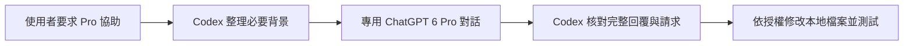

# Codex 專用：ChatGPT Pro Handoff Skill

[](LICENSE)

將目前專案必要背景交給 ChatGPT GPT-6 Pro 分析，取回建議後，由原本的 **Codex 任務**依授權修改檔案、執行測試及回報。

**Codex-only Skill.** Uses native Codex app conversation tools to consult a dedicated ChatGPT Pro chat, then returns the response to Codex for local implementation and verification. Python bookkeeping and installation use the standard library only. This is a community project, not an official OpenAI product.

## 下載

- **[下載 v0.1.0 可攜安裝 ZIP](https://github.com/ertwer2001/codex-chatgpt-pro-handoff/releases/download/v0.1.0/codex-chatgpt-pro-handoff-v0.1.0.zip)**
- [Release 與 ZIP SHA256](https://github.com/ertwer2001/codex-chatgpt-pro-handoff/releases/tag/v0.1.0)
- Skill 路徑：[skill/cj-chatgpt-handoff/SKILL.md](skill/cj-chatgpt-handoff/SKILL.md)

## 可以做什麼

- **Pro 分析、Codex 執行**：適合架構比較、程式審查、疑難排查與實作前的方案整理。
- **保留現有 Codex 模型**：以原生對話工具傳送文字，不更改 `config.toml` 的模型設定。
- **每專案獨立對話**：使用絕對專案路徑區分本機紀錄，避免同一本機紀錄庫內跨專案混用 Chat。
- **可追蹤的請求**：唯一 Request-ID、dispatching 狀態、完整原文比對、新 completed 回合、SHA256 收據。
- **避免盲目重送**：逾時或回覆不明時先查既有請求；本機狀態鎖不等於遠端 exactly-once 保證。
- **備份、保留設定與還原**：安裝前保存原檔並核對 SHA256；同內容可重跑，不同內容停止比對；還原不覆寫後續使用者改動。



## 使用條件與限制

1. **需要 Codex app 原生工具**：`mcp__codex_app__list_threads`、`mcp__codex_app__read_thread`、`mcp__codex_app__send_message_to_thread`。只有 ChatGPT 網頁或缺少這組工具的 CLI／IDE，無法完成自動往返。全域安裝 Skill 不會替用戶端新增工具。
2. ChatGPT 帳號須能在目標 **Chat** 選擇 GPT-6／6 Pro；每次傳送前重新確認。`model`／`thinking` 參數不能用來替 ChatGPT 切 Pro。
3. 本機安裝器與狀態腳本需要 **Python 3.10+**，無第三方 Python 套件依賴。實際驗證範圍見 [VALIDATION.md](VALIDATION.md)。
4. Skill 由 Codex 讀取並執行流程；狀態腳本只管理紀錄，不直接呼叫 ChatGPT。這不是把 Pro 新增到 Codex 模型選單的 provider，也不是獨立 MCP server。
5. 每台電腦安裝一次，每台電腦／每個專案綁定獨立 Chat。登入同帳號只同步雲端對話，不會同步安裝 Skill 或本地檔案權限。
6. 不承諾節省 token、訂閱額度或所有帳號／作業系統都可用；傳送與模型分析可能消耗既有訂閱額度。

## 安裝

下載 ZIP 並解壓，在含 `install.py` 的目錄執行（依環境改用 `python3` 或 `py -3`）：

```text
python -X utf8 verify_package.py
python -X utf8 install.py
python -X utf8 install.py --apply
```

第一步驗證檔案清單；第二步只顯示計畫；第三步才安裝。SHA256 是完整性檢查，不是數位簽章。

安裝目標為本機 `CODEX_HOME`，未設定則是 `~/.codex`。安裝四個 Skill 檔案，並在全域 `AGENTS.md` 追加協作入口；保留既有內容。備份預設放在 `~/cj-codex-backups/`，實際 `backup`／`receipt` 路徑會顯示在安裝結果。安裝遇到同名 Skill 不同內容會停止，請先比較再決定如何合併。

重新載入 Skills 或開啟新 Codex 任務，確認 `cj-chatgpt-handoff` 確實載入。安裝成功與原生工具往返成功須分開驗收。

### 直接交給 Codex 安裝

```text
請讀取這個儲存庫的 README.md、SKILL.md 與 install.py，
幫本機安裝 Codex 專用的 cj-chatgpt-handoff。
我授權必要的本地備份、安裝，以及一次傳往我自己的 Pro Chat 的無機密測試。
保留既有規則、模型與專案；遇到檔案衝突先比對，不直接覆蓋。
確認原生工具可用、Skill 已載入，為目前專案綁定獨立且已選 6 Pro 的 Chat。
完成唯一 Request-ID 往返，保存新 completed 回合與原文證據。
缺少權限或工具就明列，不把安裝成功當成往返成功。
```

## 日常使用

在 Codex 的專案中說：

> 請 6 Pro 幫我審查這個重構方案，再由 Codex 依本次授權處理與測試。

或直接使用 `$cj-chatgpt-handoff`。第一次使用時需建立或提供該專案的專用 ChatGPT Chat，並確認 6 Pro。普通開發與只討論 Pro 的知識問答不會自動觸發傳送。

詳細流程見 [原生轉交操作](skill/cj-chatgpt-handoff/references/native-workflow.md)。建議精簡背景；若工具截斷原始訊息，需取得完整內容才能通過核對，不要自行補字或重送同一請求。

## 還原

將 `<receipt.json>` 換成安裝結果提供的實際路徑：

```text
python -X utf8 install.py --restore "<receipt.json>"
python -X utf8 install.py --restore "<receipt.json>" --apply
```

先檢查，再還原。備份或目前檔案遭修改時會停止；保留對話、備份與執行證據。不要複製別台機器的 receipt、state、pending、lock 或登入資料。

## 開發與測試

```text
python -X utf8 -B -m unittest discover -s tests -v
python -X utf8 -B build_release.py
```

測試僅使用隔離暫存目錄，不呼叫 ChatGPT，也不安裝到真實 Codex 家目錄。`build_release.py` 更新完整性清單並產出 `dist/` 的可攜 ZIP 與 SHA256。

## 資料與授權

只傳使用者同意且任務必需的背景。Skill 不增加修改、部署、交易或敏感資料傳送權限。執行紀錄位於本機 `pro-handoff/`，可能包含專案片段，應依自己的資料規則保管；不要提交 Git。公開版已移除私人對話網址、本機路徑、請求收據及登入資料。

採 [MIT License](LICENSE)。維護者：[@ertwer2001](https://github.com/ertwer2001)。開發與文件整理使用了 Codex 及 ChatGPT Pro；實際能力依用戶端工具與帳號可用性而定。
